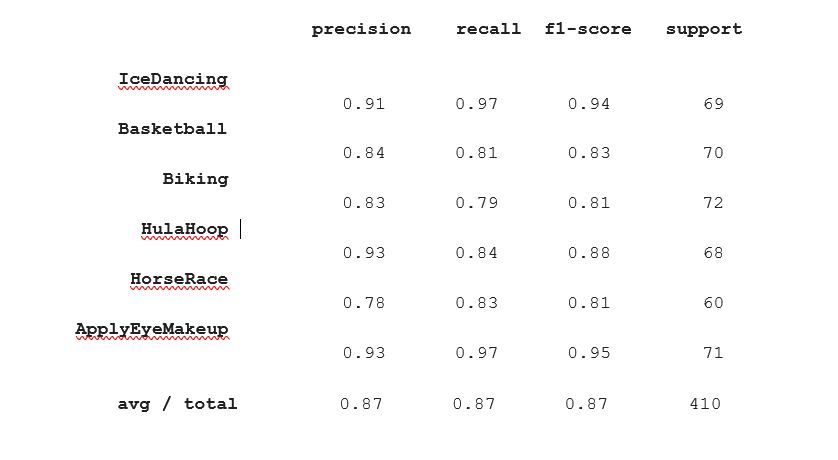
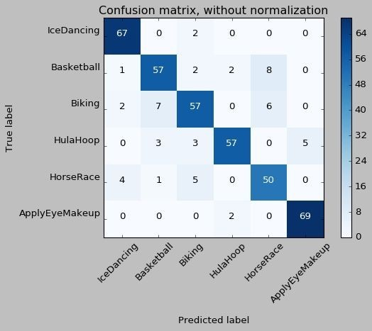
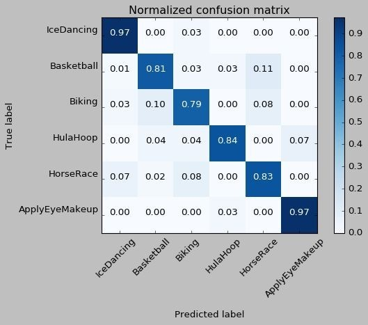
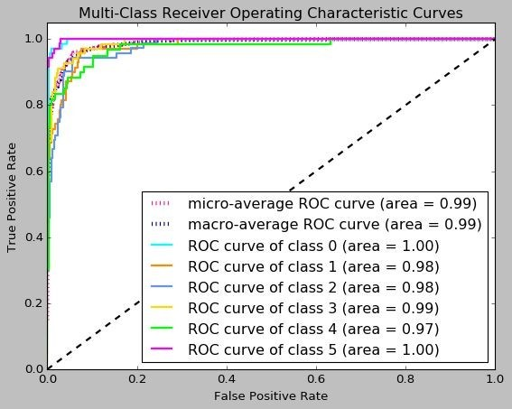

# Human-Action-detection

**Implementation Architecture:**
Implemented 3D Convolution Neural Network using Keras conv3D package. The architecture consists of 16 layers including the input. There is a alternating convolutional and rectification layers followed by subsampling which is max pooling layer. Next comes the dropout layer.This is again followed by 2 alternating convolutional and rectification layers followed by max pooling layer. Next is a dropout layer. The next layer performs flattening of the input to convert high dimensional input array into 1D array. Then a fully connected layer consisting of 2048 neurons is present which is connected to an output layer consisting of neurons equal to the number of classes used for video classification. Between the fully connected network and output layer , is a dropout layer. Dropout is a regularization technique used to prevent overfitting. Dropout rates of 0.25,0.25 and 0.5 are used in the architecture. That means the probability that an input node is kept is given by 0.5.
The architecture looks like the following:
 
The first convolutional layer uses 64 filters or kernels , the second and third convolutional layers uses 128 filters and the last convolutional layer uses 256 filters.
ReLU and Softmax activation functions are used for rectification layers.
**Dataset:**
We have used UCF101 dataset for our analysis and a glimpse of the UCF101 dataset looks like: UCF101 dataset comprises of realistic videos collected from Youtube. It contains 101 action categories, with 13320 videos in total. UCF101 gives the largest diversity in terms of actions and with the presence of large variations in camera motion, object appearance and pose, object scale, viewpoint, cluttered background, illumination conditions, etc.
 

**Video preprocessing :**
The videos are varying length sequences and 30 frames of a video are considered. Since some frames of the video are empty which means there is no action taking place, some frames are skipped according to a defined criteria i.e., taking frames in fixed intervals apart.
Each frame is resized to a size of 50 by 50 pixels and converted to grayscale for reducing the computational complexity since it is reported that luminance is by far more important in distinguishing visual features than chrominance. We tested several configurations for example, 15 frames with image sizes varying from 32 by 32 to 50 by 50 pixels. We have also tested the model with RGB color coding.

**Evaluation Metrics:** 

 
  

**Confusion Matrix:**

unnormalised confusion matrix obtained :
 

 
  

 

The normalised confusion matrix is :

 
  

 
**ROC curve:**

 
  

 

 
